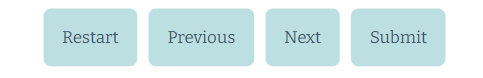

Quiz me, Sailor! is a short practice test that helps sailors get prepared for the actual test to acquire their General boat license to sail both commercially and privately. The quiz home page consists of a brief introduction to the General Boat Sailing license explaining further that this is just a practice test and not the actual test that needs to be conducted by the proper authority. After entering their name, the user referred to as a sailor throughout the site is redirected to the sailing quiz consisting of 10 scored questions.

Practice tests for sailing can be a daunting experience that stresses the life-or-death situations on rough seas if one does not know what to do. Therefore, I chose a rather simple yet playful aesthetic that takes the seriousness out of such tests and invites the user into a clean and positive learning environment with a hint of sailing culture that encourages the user to think, keep practicing, and learn from mistakes. 

# User Experience

## Goals

The target users for the boat license quiz are sailors training to acquire or renew their licenses to work in or navigate a sailing vessel privately and commercially. To pass the test, these sailors need a minimum of 70% score .

## Design

My choice of design aimed at balancing seriousness and playfulness and thus, I created a playful yet minimalistic sailing theme in words and design to help the user think clearly when assessing dangerous situations at sea mentioned on the practice test without feeling overwhelmed by the site features. The design is meant to immerse the user, referred to as the sailor, in the sailing culture using sailing dialect and providing a simple environment with intuitive navigation, balancing the seriousness behind sailing protocol tests and the playfulness and fun of sailing.

### Wireframes

Wireframes were done using Figma.
 * Find the link [here](https://drive.google.com/file/d/1QBgsp4bNOjJl9aSi-eT39jxEE8zqUybq/view?usp=sharing)

# Features

## Header and logo:

As the user is greeted by the Captain aboard he is welcomed by a minimal aesthetic design featuring soothing oceanic colors that rest the eye and helps focus the user's attention on the license practice test. The logo “Quiz me Sailor!” design colors and the Welcome aboard sign of a Captain offer a clear first impression and understanding of the purpose of the site which is to test one’s knowledge about sailing safety and protocol. 

## Introduction and username field:

To keep a clear vision of what the user is about to do, a short introduction summarising the purpose of the General Boat license test and that this is just the practice test and not the actual written test that needs to be passed at the proper authority office. The user needs to enter their name to start the quiz. The user is then directed toward the quiz questions page. 

The username field has restrictions that will not allow the use of spaces or special quaracters, only letters A to Z small or capital are allowed to avoid crashing the site. Furthermore, the username has to be more than 2 letters. If the user enters a one letter username or with special quaracters, an invalide data input message will be display letting the user know of the rules.

## Quiz page:

The quiz page features 10 questions test about sailing safety and protocol, each question features four answers to choose from (A to D). Additionally, a score panel and control buttons are also featured above and below the Q and A area. 

## Q and A area:

The user will pass a test of ten questions and each question features four answers to choose from (see image above). The user can only click on one answer per question. Once the user clicks on an answer the other answer options are disabled (disableBtn function) then the user is informed whether he answered the question correctly or not. The correct answer turns green and the incorrect answer red. A message below the Q and A area appears confirming and informing the user of the answer he chose (see image above) and the correct answer.

## Score:

Above the Q and A area, a score out of 10 is displayed. Every time the user answers correctly the score increments by 1 point. The score is saved and displayed throughout the test and at the end of the quiz when the user submits, they will see the final score accompanied by a message to keep practicing as done at sailing school and by the sea rule don't congratulate a sea mate but encourage to keep practicing and learning because the sea is unforgiving and one has to stay sharp. The candidate needs a minimum score of 70% to pass the test. A different message will show depending on the score.s

## Control buttons

### Restart

Allows the user to stop the quiz and go back to the home page and restart from the beginning.
### Next

Allows the user to skip to the next answer after answering or choosing not to.
### Previous

This button appears once the second question is displayed. It allows the user to go back to previous questions and check the answers they entered, for instance.
### Submit

Allows the user to end the quiz, submit the answered questions and check the final score. 
 ### Finale Message

 

 Once the user has submited their quiz answers, depending on the score, a message matching the score appears encouraging further practice as done in sailing school “never congratulate, always push more practice!”.

# Technologies 

## languages
  
  ### HTML
  * Page markup
  ### CSS
  * Styling
  ### Javascript
  * Running functions for interactive components
## Libraries
 ### Google Fonts
 * Font Styles.

## Platforms
 ### Github
 * Storing code remotely and deployment.
 ### Gitpod
 * IDE for project development.
## Other Tools
  1. **Figma**
     * To create wireframes
  2. **Favicon.io**
     * to create a favicon
  4. **freepik** 
     * To download free images such as the background image
  5. **Resizepixe**
     * To resize images

# Methods
## Validation
  * HTML has been validated with W3C HTML5 Validator and the errors found were all corrected.
  * CSS has been validated with W3C CSS Validator and the errors found were all corrected.
  * Javascript has been tested and validated using Jshint and the warnings reported were all corrected.
  
## Testing
  * The site has been through a rigorous testing process of sailing quiz enthusiasts among friends and family members, including my mentor and myself
  * Each feature was first tested on the developer tools before being added to the VScode
  * The user cannot start the quiz without filling in the username field
  * Various bugs have been reported and solved (see bugs section for further details) 
  * As the creator, I checked manually all the features and passed and failed the quiz to cover all scenarios that the user might go through. 
## Mobile Testing
  * The site was tested personally on IOS and Android using Chrome and Safari going through all pages and functions
  * The responsiveness has been adjusted for different screens including mobile screens
  
## Desktop Testing
   * The site was tested by different people on Chrome where it has initially been developed
   * The site has continuously been tested on Edge by friends
## Accessibility

  * The overall performance of the site has been tested in desktop and mobile using Lighthouse and the site has passed the accessibility test

# Bugs

* The score was incremented upon clicking on the correct answer several times. This was solved by saving the users answers and not allowing the user to answer more than once. This furthermore solve an additional issue, whereby the previous button allowed cheating by answering the incorrect answer for instance then clicking next and immediately after clicking previous to answer the previous question.

* The submit button ended the quiz, but the answer choices for the first question were still displayed this was solved by hiding the unneccessary elements including the questions.

* The username field didn't save the users's name to display it at the end of the quiz and in the messages. This was solved by handing the username to the quiz page via an URL parameter.

* The theme of the previous version of the quiz was English grammar with true or false option answers. However, that was boring and uninspiring therefore, it was solved by changing the theme to sailing which is a fascination of mine with more challenging features.

# Deployment

* The site was deployed to GitHub following the code institute video instructions
   1. Go to the Settings page of the repository
   2. Scroll down to the Github Pages section
   3. Select the Master Branch as the source and Confirm the selection
   4. After a minute or two and it should be live for viewing. [You will find the link here](https://douniabk.github.io/Quiz-me-Sailor/)

# Credits and Contact

## Content
* The quiz questions are from [New South Wales - General Licence](https://https://www.easy-quizzz.com/au/learners-test/nsw-boat-licence-test/boat-licence-practice-test/)
* Part of the initial structure of the javascript quiz code has been done following a guide from [Coding Ninjas](https://www.codingninjas.com)
* The background image has been taken from freepik
## Contact
Feel free to contact me at douniazedbacha@gmail.com
